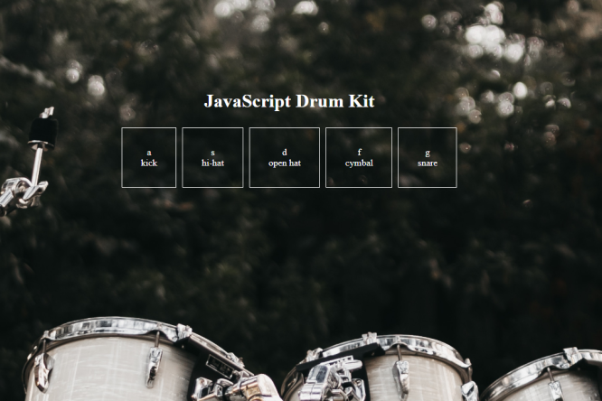

# BrianJavaScript30

Going through Wes Bos's JavaScript 30 challenges in Hard Mode.
https://javascript30.com/

My Strategy has been to watch just the beginning of the videos and try to work out a solution on my own. And then finish the video to see how Wes did it.
This takes longer, but I believe its more fun and I learn more. Also it is interesting to see what I do the same or different from Wes.

## Project 1 - JS Drum Kit

I had a lot of fun coding this. Using transitions in CSS was new to me, as well as playing sound in the browser.

## Project 2 - CSS and JS Clock

Creating this was a challenge. I hadn't used CSS transformation or had to access the Date() object in JS until now.
At first I had tried to create the moving hands by grabbing the date, setting the hands, then using animations and keyframes to rotate 360 degrees. The clock would always end up out of sync pretty quick this way. 
Instead, it now grabs the date every second and then sets the hands to that. 

New concepts: CSS transformations, animations, keyframes, setting styles in JS.

## Project 3 - Update CSS Variables in JS

It was awesome to learn how useful CSS variables are. They way I accessed them in my JavaScript was a little different from Wes. I enjoy these challenges, but watching how Wes completes them is almost discouraging because of how efficient he is! Learning about data- and the dataset objects from his video will be useful.

## Project 4 - Array Cardio Day 1

Most of these array methods I felt pretty comfortable with already. It was good to get more practice using .reduce().
Watching Wes's videos gave me a better understanding of .sort().

## Project 5 - Flex Panel Gallery

I cheated a little on this one. I used the starter file provided. It was good to get some practice in with flex-box, and learning the value of nesting flex boxes.

## Project 6 - AJAX Type Ahead

I used a dynamically created Regular Expression for finding matches. At first attempt this ran very clunky. After refactoring the code it ran smoothly.